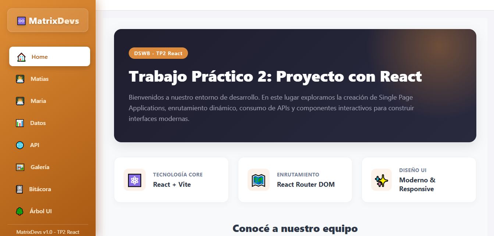
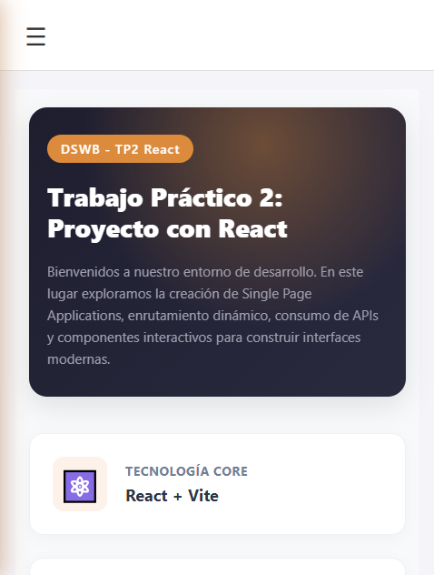
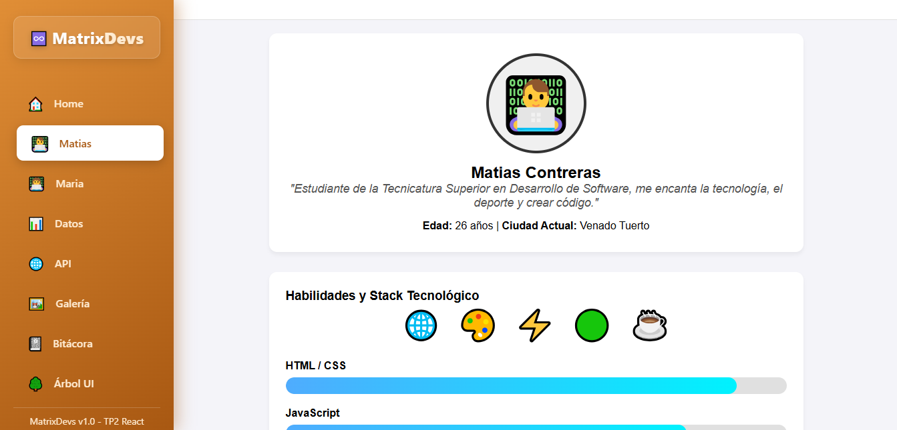
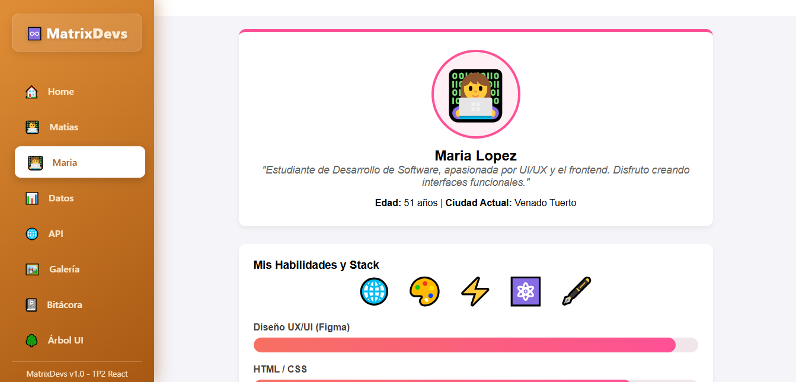
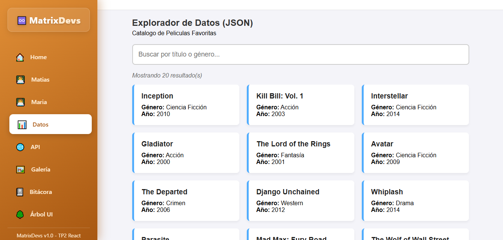
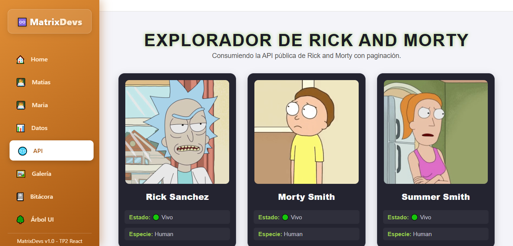
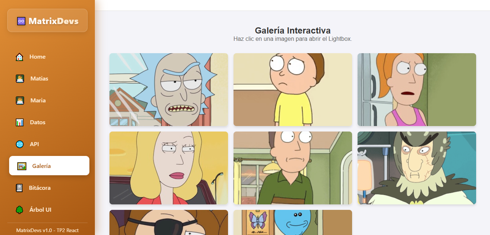
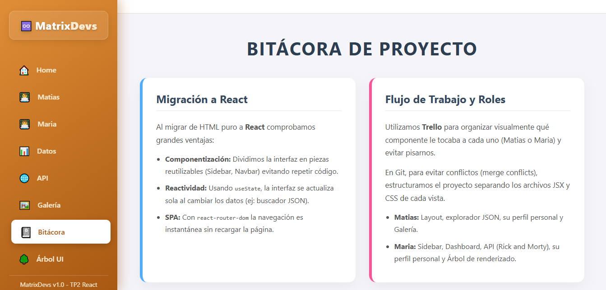
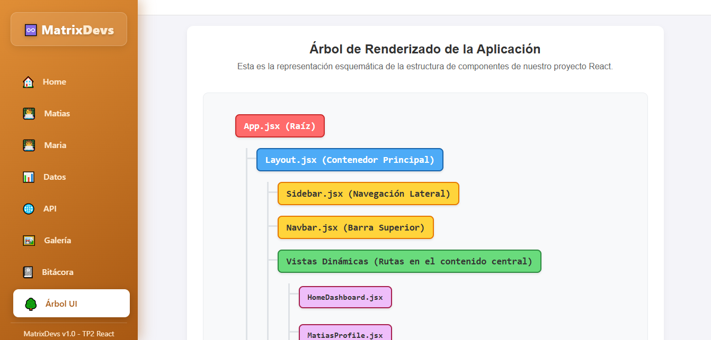

# TP2 Proyecto React - MatrixDevs

### Enlace al deploy en Vercel: [Visitalo](https://tp-2-proyecto-react.vercel.app/)

## Descripción del Proyecto
Este proyecto representa el desafio de migrar nuestro Trabajo Práctico 1 hacia una arquitectura moderna basada en componentes utilizando **React**. Pasamos de un sitio estático en HTML/JS a una **Single Page Application (SPA)** completamente dinámica. Se aplicaron buenas prácticas de organización, enrutamiento, diseño adaptable(responsive) y consumo de datos locales y externos.

## Integrantes del Equipo
* **Maria Lopez** - [GitHub](https://github.com/Marialopez2020)
  * *Desarrolló el Sidebar, Home Dashboard, la integración de la API pública y el Árbol de Renderizado.*
* **Matias Contreras** - [GitHub](https://github.com/Matihp)
  * *Desarrolló el Layout principal, el Explorador de datos locales (JSON), la Galería de imágenes y el diseño responsive general.*

## Tecnologías Utilizadas
* **React**: Librería principal para la construcción de interfaces de usuario mediante componentes.
* **Vite**: Entorno de desarrollo ultrarrápido y empaquetador.
* **React Router DOM**: Gestión de rutas dinámicas para navegar sin recargar la página.
* **CSS3**: Se utilizaron estilos avanzados como Flexbox, Grid, Media Queries y animaciones.
* **Fetch API**: Consumo asíncrono de API externa.
* **JSON Local**: Renderización en tiempo real de una base de datos local.
* **Git/GitHub**: Control de versiones y trabajo colaborativo.

## Guía de Estilos (MatrixDevs)
* **Temática**: Estilo claro y minimalista, contrastando con tonos cálidos tipo "Caramelo/Toffee" (`#db8b3b`, `#a85812`) en la barra lateral y cabeceras.
* **Tipografía**: Fuentes modernas sans-serif (`Inter`, `system-ui`).
* **Efectos Visuales**: 
  * **Glassmorphism**: Fondos translúcidos con `backdrop-filter: blur()`.
  * **Micro-animaciones**: Transformaciones al hacer hover (`scale`, `translateY`), botones interactivos y sombras dinámicas.
* **Diseño Responsivo**: Implementación de un menú hamburguesa y grillas adaptables para garantizar una correcta visualización en dispositivos móviles (`max-width: 768px`).

## Estructura de Archivos
* `/`: `index.html`, `package.json`, `vite.config.js` y `README.md`.
* `/src`: `App.jsx` (Enrutador principal) y `main.jsx` (Punto de entrada).
* `/src/components`: Componentes estructurales reutilizables.
  * `/Layout`: Contenedor principal responsive con menú hamburguesa.
  * `/Sidebar`: Menú lateral de navegación.
  * `/Navbar`: Barra superior.
* `/src/views`: Vistas de la aplicación (HomeDashboard, Perfiles, DataExplorer, ApiIntegration, Gallery, Bitacora, RenderTree).
* `/src/data`: `datos.json` (base de datos simulada con 20 objetos).
* `/public`: Recursos estáticos e imágenes.

## Funcionalidades Implementadas (Requerimientos)

1. **Navegación Estilo Dashboard**: Sidebar lateral con iconos, que indica visualmente la ruta activa y se oculta inteligentemente en dispositivos móviles.
2. **Panel Central (Home)**: Vista principal con una vista detallada de las tecnologías utilizadas y accesos rápidos a los perfiles con avatares dinámicos.
3. **Perfiles Profesionales**: Páginas individuales con barras de progreso de habilidades **animadas**, un **carrusel de proyectos** funcional e iconos de tecnologías.
4. **Explorador de Datos Locales**: Consumo de un JSON con 20 objetos, incluyendo un buscador con lógica de **filtro en tiempo real**.
5. **Integración de API Externa**: Consumo asíncrono de una API pública con manejo de estados (`Cargando...`, `Error`) y un sistema de **paginación** completo.
6. **Galería Interactiva**: Grilla de imágenes con un **Lightbox** integrado que permite hacer zoom, navegar entre fotos y cerrar con la tecla ESC.
7. **Bitácora y Árbol de Renderizado**: Documentación interna justificando la migración a React, el flujo de trabajo en Git y un diagrama esquemático de la jerarquía de componentes.

## Capturas de Pantalla
En esta sección se presentan las vistas principales del sitio web:

### Vistas Generales

*Dashboard principal con una vista detallada de tecnologías y acceso rápido a perfiles.*

*Demostración del diseño responsive en dispositivos móviles con el menú hamburguesa.*

*Vista del perfil de Matias con barras animadas y carrusel de proyectos funcionales.*

*Vista del perfil de Maria con barras animadas y carrusel de proyectos funcionales.*

*Explorador de datos JSON con filtro de búsqueda en tiempo real.*

*Integración asíncrona de la API pública de Rick and Morty con paginación.*

*Galería de imágenes responsiva.*

*Documentación interna y justificación técnica de la migración a React.*

*Esquema visual detallando la jerarquía del Árbol de Renderizado de la aplicación.*

## Funciones Dinámicas y Componentes Clave (JavaScript / React)
Durante el desarrollo se implementaron las siguientes lógicas y Hooks de React:
* **`useState`**: Gestión de estados locales. Se utilizó para controlar el menú hamburguesa en el `Layout`, manejar el texto del buscador en el `DataExplorer`, almacenar la página actual en `ApiIntegration` y cambiar las imágenes en el carrusel de los perfiles.
* **`useEffect`**: Manejo de efectos secundarios. Principalmente utilizado para realizar las peticiones a la API externa y para detonar animaciones de entrada (ej: barras de progreso).
* **`map()` y `filter()`**: Métodos nativos de arreglos en JavaScript. `map()` fue esencial para renderizar las tarjetas del JSON y los elementos de navegación. `filter()` se empleó en el `DataExplorer` para lograr la búsqueda en tiempo real.
* **`fetch()`**: Utilizado dentro de funciones asíncronas (`async/await`) en `ApiIntegration` para obtener los datos de la API pública de Rick and Morty de forma dinámica.
* **`useLocation`**: Hook de React Router DOM usado en el `Sidebar` para detectar la ruta actual (`location.pathname`) y aplicar la clase CSS `.activo` de manera condicional.

## Uso de Inteligencia Artificial
* **Herramientas Utilizadas**: IA Gemini.
* **Uso en Código y Lógica**: Se consultó a Gemini como asistente técnico para diseñar la estructura lógica de los componentes más complejos, como el sistema de paginación en `ApiIntegration`, la lógica de filtrado del buscador y para mejorar el diseño responsive (Media Queries).
* **Generación de Contenido**: Se utilizó la IA para optimizar la redacción de este archivo `README.md` en formato Markdown.
* **Iconografía e Imágenes**: Para los avatares decidimos reemplazar imágenes generadas por emojis nativos (`👨‍💻`, `👩‍💻`) para un diseño más limpio.

